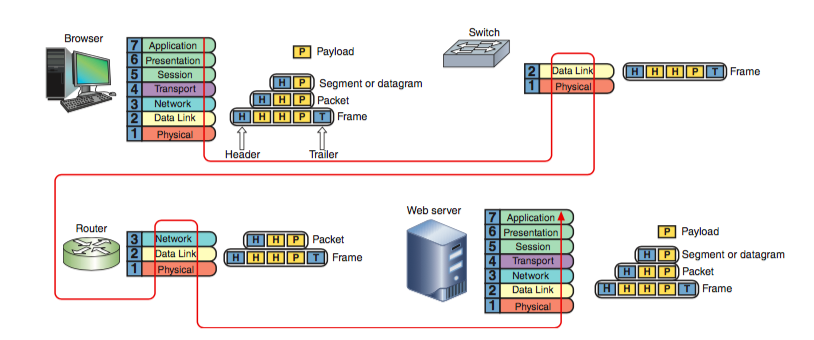
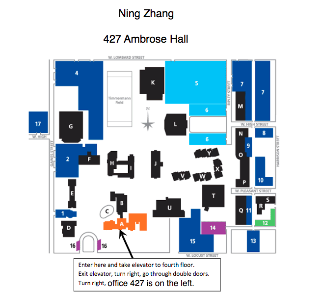

# CSCI 270 Spring 2021

## Why should we learn this course?
1. Core courses of CS:
+ Computer Organization and Architecture
+ Data Structures and Algorithms
+ Operating Systems
+ Fundamentals of Compiling
+ **Computer Networks**
2. Waves of technologis
+ Search Engine
+ Big Data
+ Cloud Computing
+ AI
+ BlockChain

For the architecture of any big system, good **network** -> half done.
**Computer Networks** is foundation of many new technologies.

# Chapter 1: Introduction to Networking

## Objectives
+ client-server vs. peer-to-peer networks
+ types of applications and protocols
+ hardware devices and physical topologies
+ seven-layer OSI model
+ safety and trouble-shooting

# Q: What is a network?
## network
  + hardware devices
  + topologies
  + protocols 

## hardware devices
For example?

## topologies
A topology describes how the parts of a whole work together.
+ physical topologies (hardware)
  - Devices fit together to form a network.
+ logical topologies (software)
  - Has to do with software, how access to the network is
controlled, including how users and programs initially gain access to the
network, and how specific resources, such as applications and databases, are
shared on the network.
### Network Models
  + peer-to-peer(P2P):
  OS of each computer controls its own adiministrations, resources and security without a centralized control. The computers are also connected directely.
  
  
  
  + Advantages and Disadvantages of P2P
    - advantages:
      + easy to set up
      + not expensive
      
    - disadvantages:
      + not scalable: not easy to add more devices to the network
      + not necessarily secur: data can be easily discovered and used by unauthorized people.
      + not practical for 15 computers
      
   + client-server:
  controlled by NOSes (network operating systems), via a centralized directory database
  ~~~~
  domain: computers/clients controlled by the server
  AD(active directory): the centralized directory database
  AD DS(domain service):: manages clients' getting accesss to server
  ~~~~
  
  
  
  + Advantages and Disadvantages of Client-Server
     - advantage
      + user account and password
      + resources sharing
      + problems are easy to fix
      + more scalable
     - disadvantage
      + more complex in their design and maintenance
      
### applications vs. protocals
  + The resources a network makes available to its users include applications and the data
provided by these applications. Collectively, these resources are usually referred to as
network services.
  + protocals are agreements.
  + applications follow protocals.
  
  #### Protocals: 
  A protocal consists of 
  1. syntax：  in some specific format.
  2. semantic: meaningful.
  3. sequence: in order.
  Only throught protocals, a group of computers can colaborate to complete a huge task.
  #### Examples
  1. Data transmission: TCP, UDP, IP
  2. Web service: HTTP, HTTPS (for both server and client)
  3. Email service: SMTP (for client), POP3, IMAP4 (for server)
  4. FTP service: FTP (client-server)
  5. Telnet/remote control service: telnet(client-server)
  6. ...
  **Protocals in OSI seven-layer model**
  
  
  
             
  #### Characteristics of protocals:
  1. too many to remember
  2. You feel you understand some protocal, but you can not explain it clearly.
  3. You do not know how to solve practical problems.
  #### Procedure of learning  protocals:
  1. You feel you know it once you learn it
  2. You feel overwhelmed when being asked questions
  3. You feel frustrated in real projects.
  
  #### How to learning Computer Networks/Protocals?
  1. use daily examples
  2. use CISCO Packet Tracer
  [CISCO Packet Tracer: download and training course](https://www.netacad.com/courses/packet-tracer)
  
  3. imagine you are "there"
  

  ## Network Hardware
  ### LANs(Local Area Network) and their hardware
  **local**: each node on the network can communicate with each other directly.
  
  
  #### topologies
  **bus topology** 
  
  **ring topology**(legacy topology, barely used today)
  
  **star topology**
  
  Note here: Someone claims that it is not a star topology with a hub in the center, because hub will send the received 
  message to any other devices, which makes it equal to a ring topology.
  
  **mesh topology** 
  
  
  
  
  **hybrid topology** 
  
  #### hardware
  1. [Hub](https://en.wikipedia.org/wiki/Ethernet_hub) (legacy device)
  
    A hub receives signals from one node and repeast those signals to all other connected nodes in a broadcast way.
    (one to all)
  2. [Switch](https://en.wikipedia.org/wiki/Network_switch)
  
    (one to one)
  **compare hubs and switches in CISCO Packet Tracer**
  
  3. Network Port(where you plug your network cable)
  
  + on motherboard
    
    
    
  + on NIC(network interface card)
    
    
    
  4. Router
  
    a device that manages traffic between two or more networks and can find the best path.
   
  **switch/hub** vs. **router**
  
  + A switch/hub belongs to one LAN.
  
  + A router belongs to two or more LANs.
  
  
  
  ### WAN and MAN
  
  **WAN(wide area network)**: a group of LANs that spreads over a wide geographical area.
  
  **MAN(metropolitan area network)**: a group of LANs that spreads in the same geographical area.
  
  + WAN and MAN/CAN(campus area network) might be used interchangeably.
  + The internet is the largest WAN.
  + PAN(personal area network) is the smallest network, which is a network of your own devices.
  
  ## Seven-layer OSI(open system interconnection) Model
  ### why multiple layers?
  1. We need a program/application to transmit data.
  2. The program is complicated.
  3. Every complicated program should have multiple layers, this is the principle of software engineering.
  
  #### without OSI layers
  
  
  #### OSI layers
  
  
  Q: How to understand this 7-layer OSI model?
  
  A: <li>A message/transmission is a buffer or a block of memory in some format.</li>
     <li>Imagine you are some applicatiom/program to deal with this message. You can be on the PC, server, router or switch...</li>
     <li>Imagine you have multple ports, you get the message from one port and send it through another.</li>
     
  **Layer 7: Application layer**
  + Interface between two applications, each on seperate computers.
  
  + Protocals:  HTTP, SMTP, POP3, IMAP4, FTP, Telnet, RDP.
  
  + Two categories:
  
    - Applications for users: browser
    - Applications for operating system
  
  **Layer 6: Presentation layer**
  + responsible for reformatting, compressing, and/or encrypting data 
  
  **Layer 5: Session layer**
  + responsible for describing how data between applications is synced and recovered if messages do not arrive intact with the receiving application.
  
  *Note that:* Layer 7,6,5 are so interwined in practice. Usually OS provides the APIs.
  
  **Layer 4: transport layer**
  + Responsible for transporting
  + Protocals: TCP(transmisson control protocal), UDP(user datagram protocal)
  + encapsulation: TCP and UDP add their own control information, called **header** to the message from upper layers.
  
  **Layer 3: Network layer**
  + responsible for moving data from one node to another until they reach the destination.
  + protocal: IP(internet protocal), each node has an IP address.
  
  **Layer 2: Data Link Layer**
  + Responsible for interfacing with physical hardware only on the local network.
  + Protocals: programmed into the firmware of a computer's NIC and other networking hardware. (Firmware refers to programs embedded in hardware.)
  + MAC(media access control) address: physical address, layer 2 adds MAC info.
  
  **Layer 1: Physical Layer**
  + responsible for sending bits.
  
  **PDU: protocal data unit**: message from one layer to another
  
  | OSI Layer(s)      | PDU name | Extremely technical name|
| ----------- | ----------- |--------|
| layer 7 Application Layer  layer 6 Presentation Layer     layer 5 Session Layer          | payload or data       |L7PDU|
| layer 4 Transportation Layer   | Segment(TCP)/datagram(UDP)        |L4PDU|
|layer 3 Network Layer|Packet|L3PDU|
|layer 2 Data Link Layer|Frame|L3PDU|
|layer 1 Physical Layer|bit/transmission|L1PDU|

**Summary of 7-layer OSI model**:  

**Discussion**

1. IP vs. MAC

+ IP address is not unique.

+ MAC address is unique.

  
  <!-----
2. **Remember this all the time:**

+ **PDUs are complete**.(They must be formatted.)
+ **PDUs can contain info from lower levels without info from upper levels.**
+ **PDUs can not contain info from upper levels without info from lower levels.**
---->

 
 
 
# Safety Procedures and Polices
Network and computer technicians need to know how to protect themselves as well as protect sensitive electronic components.

## Emergency procedures
  + Know the best escape route or emergency exit
## Fire Suppression Systems - have a fire suppression system in the data center that includes:
  + Emergency alert system
  + Portable fire extinguishers
  + Emergency power-off switch
  + Suppression agent
## Fail Open or Fail Close - does the security system allow access during a failure (fail open) or deny access during the failure (fail close)
##  Material Safety Data Sheet (MSDS) - explains how to properly handle substances such as chemical solvents and how to dispose of them
  + Includes information such as physical data, toxicity, health effects, first aid, storage, shipping, disposal, and spill procedures
## HVAC Systems
  + Heating, ventilation, and air conditioning (HVAC) system - controls the environment in a data center, including the temperature, humidity, airflow, and air filtering
  + HVAC system must provide acceptable temperature and humidity ranges for devices that might overheat or fail due to high humidity
  + HVAC systems and network cabling often occupy the space above the ceiling or below the floor in a data center(Called the plenum)
## Protecting Against Static Electricity
  + Computer components are grounded inside a computer case
  + Sensitive electronic components can be damaged by electrostatic discharge (ESD)
  + Static electricity can cause two types of damage:
    - Catastrophic failure - destroyed beyond use
    - Upset failure - shorten the life of a component
  + Before touching a component, ground yourself by:
    - Wearing an ESD strap around your wrist that clips onto the chassis or computer case
    - Touching the case before touching any component inside the case
    - Storing a component inside an antistatic bag
  + In addition to protecting against ESD, always shut down and unplug a computer before working inside it
## Installation Safety
Lifting Heavy Objects - follow these guidelines:
  + Decide which side of object to face so load is most balanced
  + Stand close to the object with your feet apart
  + Keep your back straight, bend knees and grip load
  + Lift with your legs, arms, and shoulders (not your back or stomach)
  + Keep the load close to your body and avoid twisting your body while you’re holding it
  + To put the object down, keep your back as straight as possible and lower object by bending your knees
  + Rack Installations - switches, routers, servers, and patch panels can be installed in racks
    - Follow device manufacturer’s guidelines for requirements for the rack and the direction for installation
  + General directions for safely installing rack-mountable devices:
    - Engage brakes on rack wheels, if applicable
    - Wear an ESD strap
    - Place the device in the rack for good airflow
    - Device must be well grounded
    - Pay attention to tools as you work so they don’t accidentally fall into a rack of expensive equipment
    - Install fan trays so that air flows in the same direction as the fans inside the device
 ## Electrical and Tool Safety in Data Centers
 + Electrical and tool safety is generally regulated by OSHA (Occupational Safety and Health Administration)
 + OSHA guidelines when using power tools:
    - Wear personal protective equipment (PPE)
    - Keep all tools in good condition and properly store tools not in use
    - Use the right tool for the job and operate the tool according to the manufacturer’s instructions
    - Watch out for trip hazards, so you and others don’t stumble on a tool or cord
    
# Troubleshooting Network Problems
## Troubleshooting steps used by most expert networking troubleshooters:
+ Identify problem
  - Gather information
  - Identify symptoms
  - Question users
  - Determine if anything has changed
+ Establish theory of probable cause
  - Question the obvious
+ Test theory to determine cause
  - If theory confirmed, determine next steps
  - If theory not confirmed, establish new theory or escalate
+ Establish action plan
+ Implement solution or escalate the problem
+ Verify full functionality
  - Implement preventative measures if applicable
+ Document findings, actions, outcomes
  

      
  
  

